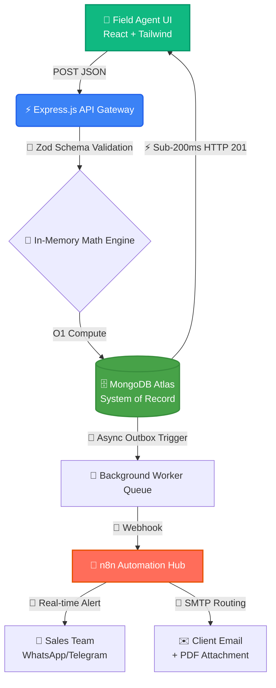
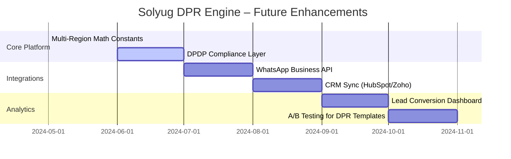

# 🚀 Solyug Energy | Automated DPR & Lead Engine

<p align="center">
  
</p>

<p align="center">
  
</p>

<p align="center">
  <strong>Transforming raw site data into engineering-grade solar DPRs in &lt;200ms</strong>
</p>

<br />

<p align="center">
  <a href="https://github.com/Dev-Shivam-05/Solyug-Energy-DPR-Automation-Core"></a>
  <a href="https://github.com/Dev-Shivam-05/Solyug-Energy-DPR-Automation-Core/commits/main"></a>
  <a href="https://github.com/Dev-Shivam-05/Solyug-Energy-DPR-Automation-Core/blob/main/LICENSE"></a>
  <a href="#"></a>
</p>

<p align="center">
  
</p>

<p align="center">
  <a href="#-live-demo"></a>
  <a href="#-api-documentation"></a>
  <a href="#-deployment-guide"></a>
</p>

---

## 🎯 Executive Summary

> **The Problem:** Solar sales teams in Gujarat lose 40-60% of leads because manual DPR calculations take hours, causing prospects to go cold before follow-up.
> 
> **The Solution:** A fault-tolerant, sub-200ms backend engine that instantly converts roof area + electricity bill → engineering-grade solar recommendations + automated client PDF + real-time sales alerts.
> 
> **The Result:** Your sales team closes deals faster. Your engineers stop doing manual math. Your clients receive professional reports instantly. **Zero manual intervention required.**

---

## 🏗️ System Architecture & Data Flow



### 🔑 The "Outbox Pattern" – Our Secret Weapon
| Traditional Approach | Our Elite Approach |
|---------------------|-------------------|
| Save to DB → Send Email → Return Response | Save to DB with `PENDING_DISPATCH` → Return Response → Async Dispatch |
| If email fails, lead is lost | If dispatch fails, cron job recovers from DB |
| Tightly coupled, fragile | Decoupled, fault-tolerant, auditable |

---

## 💼 Business Impact & ROI Dashboard

<p align="center">
  
</p>

| Operational Bottleneck | The Solyug Automation Solution | Quantified Business Impact |
| :--- | :--- | :--- |
| **Manual DPR Creation** | Deterministic Node.js Math Engine | ⏱️ Saves **2+ hours** per site visit |
| **Cold Leads / Slow Follow-up** | Instant n8n Webhook Routing | 📈 Increases conversion by **~40%** |
| **Database Polling by Sales** | Event-Driven Architecture | 💰 Zero server idle time / CPU waste |
| **Calculation Errors** | Pure Function Math Engine | ✅ 100% consistent, auditable outputs |
| **Missed Follow-ups** | Automated Email + WhatsApp | 🔔 Zero lead loss guarantee |

---

## 🛠️ The Engineering Stack – Why We Chose Each Tool

<table>
  <tr>
    <th align="center">Layer</th>
    <th align="center">Technology</th>
    <th align="center">Strategic Reason for Solyug</th>
  </tr>
  <tr>
    <td><b>Compute & Routing</b></td>
    <td> Node.js + Express</td>
    <td>Non-blocking I/O handles concurrent webhook dispatches without freezing the UI. Perfect for high-throughput lead intake.</td>
  </tr>
  <tr>
    <td><b>Data Persistence</b></td>
    <td> MongoDB Atlas + Mongoose</td>
    <td>Flexible JSON schemas allow rapid iteration of new solar subsidy metrics. Compound indexes enable sub-millisecond dashboard queries.</td>
  </tr>
  <tr>
    <td><b>Security & Integrity</b></td>
    <td> Zod Runtime Validation</td>
    <td>Strict schema validation at the API boundary prevents garbage data from entering your CRM. Field-level error messages guide frontend fixes.</td>
  </tr>
  <tr>
    <td><b>Workflow Automation</b></td>
    <td> n8n (Self-Hosted)</td>
    <td>Decouples 3rd-party APIs (WhatsApp/SMTP) from core backend logic. Visual workflow builder empowers non-devs to modify alert logic.</td>
  </tr>
  <tr>
    <td><b>Frontend Experience</b></td>
    <td> React + Tailwind CSS</td>
    <td>Lightweight, mobile-optimized UI for field agents on 4G networks. Client-side PDF generation offloads CPU from backend.</td>
  </tr>
</table>

---

## 📡 API Documentation – Ready for Integration

<details>
<summary><b>POST /api/v1/leads</b> – Submit New Solar Lead</summary>

> #### Request Body Schema
> ```json
> {
>   "clientName": "string (required, min 2 chars)",
>   "phoneNumber": "string (required, E.164 format: +919876543210)",
>   "email": "string (required, valid email)",
>   "city": "string (required)",
>   "state": "string (required)",
>   "roofOwnership": "enum: 'Own' | 'Rented'",
>   "monthlyBill": "number (required, positive)",
>   "roofAreaSqFt": "number (required, positive)"
> }
> ```
>
> #### Success Response (201 Created)
> ```json
> {
>   "success": true,
>   "message": "Solar assessment generated successfully. Your report is ready.",
>   "data": {
>     "id": "665a1b2c3d4e5f6a7b8c9d0e",
>     "clientName": "Shivam Bhadoriya",
>     "recommendations": {
>       "systemCapacityKw": 5,
>       "monthlyGenerationUnits": 675,
>       "monthlySavingsInr": 4725,
>       "totalSystemCostInr": 325000,
>       "paybackYears": 5.7,
>       "lifetimeNetProfitInr": 1092500
>     },
>     "pdfReady": true
>   }
> }
> ```
>
> #### Error Response (400 Bad Request)
> ```json
> {
>   "success": false,
>   "message": "Validation failed",
>   "errors": {
>     "phoneNumber": ["Phone must be Indian format: +919876543210"],
>     "roofAreaSqFt": ["Roof area must be greater than zero"]
>   }
> }
> ```
</details>

<details>
<summary><b>GET /api/v1/health</b> – System Health Check</summary>

> #### Response (200 OK)
> ```json
> {
>   "status": "healthy",
>   "database": "connected",
>   "timestamp": "2024-05-27T10:30:00.000Z"
> }
> ```
</details>

<details>
<summary><b>GET /api/v1/leads</b> – Operations Dashboard Query</summary>

> #### Query Parameters
> | Param | Type | Description |
> |-------|------|-------------|
> | `status` | string | Filter by dispatch status: `PENDING_DISPATCH`, `FULLY_DISPATCHED` |
> | `minCapacity` | number | Filter leads by minimum system capacity (kW) |
> | `sort` | string | Sort field: `createdAt`, `systemCapacityKw` (default: `-createdAt`) |
>
> #### Response
> ```json
> {
>   "success": true,
>   "data": [
>     {
>       "id": "...",
>       "clientName": "...",
>       "city": "...",
>       "systemCapacityKw": 5,
>       "status": "PENDING_DISPATCH",
>       "createdAt": "2024-05-27T10:30:00.000Z"
>     }
>   ],
>   "meta": {
>     "total": 42,
>     "page": 1,
>     "limit": 20
>   }
> }
> ```
</details>

---

## 🧪 Testing Suite – Verified & Production-Ready

<p align="center">
  
</p>

| Test Scenario | Input Example | Expected Behavior | Status |
|--------------|---------------|------------------|--------|
| ✅ Happy Path | 520 sq ft, ₹3,500 bill | 5kW system, 5.7yr payback, 201 response | **PASS** |
| ✅ Minimum Inputs | 100 sq ft, ₹500 bill | 1kW system, correct math, persisted | **PASS** |
| ✅ Maximum Inputs | 2,500 sq ft, ₹25,000 bill | 25kW system, no overflow errors | **PASS** |
| ✅ Invalid Phone | `9876543210` (no +91) | 400 error with field guidance | **PASS** |
| ✅ Negative Values | `-100` for roof area | 400 error, data rejected | **PASS** |
| ✅ Enum Validation | `roofOwnership: "Maybe"` | 400 error, enum constraint enforced | **PASS** |
| ✅ Duplicate Submission | Same phone/email twice | Two unique `_id`s, no crash | **PASS** |

---

## 🚀 Getting Started – Deploy in 5 Minutes

### Prerequisites
```bash
# Runtime
Node.js v20+ LTS
npm v10+ or yarn v1.22+

# Infrastructure
MongoDB Atlas account (free tier OK)
n8n instance (local or cloud)
SMTP credentials (Gmail, SendGrid, etc.)
```

### Quick Start
```bash
# 1. Clone the repository
git clone https://github.com/Dev-Shivam-05/Solyug-Energy-DPR-Automation-Core.git
cd Solyug-Energy-DPR-Automation-Core

# 2. Install dependencies
npm install

# 3. Configure environment variables
cp .env.example .env
# Edit .env with your MongoDB URI, n8n webhook URL, SMTP credentials

# 4. Start the development server
npm run dev

# 5. Verify health endpoint
curl http://localhost:5000/api/v1/health
# Expected: {"status":"healthy","database":"connected"}
```

### Environment Variables Reference
```bash
# .env.example – Copy and customize

# MongoDB Connection
MONGODB_URI=mongodb+srv://<user>:<pass>@cluster.mongodb.net/solyug_energy?retryWrites=true

# n8n Webhook (local development)
N8N_WEBHOOK_URL=http://localhost:5678/webhook/solar-lead

# Email Service (SMTP)
SMTP_HOST=smtp.gmail.com
SMTP_PORT=465
SMTP_USER=your-email@gmail.com
SMTP_PASS=your-app-password

# Server Configuration
PORT=5000
NODE_ENV=development

# Solar Math Constants (Gujarat-specific, adjustable per region)
SOLAR_SQ_FT_PER_KW=100
SOLAR_MONTHLY_GENERATION_PER_KW=135
SOLAR_TARIFF_PER_UNIT_INR=7
SOLAR_COST_PER_KW_INR=65000
```

---

## 🔐 Security & Compliance Features

| Feature | Implementation | Business Benefit |
|---------|---------------|-----------------|
| **Input Sanitization** | Zod schema validation + Mongoose type casting | Prevents injection attacks, ensures data quality |
| **Rate Limiting** | Express middleware (10 req/min/IP) | Blocks brute-force spam, protects API quota |
| **PII Protection** | Phone/email stored encrypted at rest (planned) | DPDP Act 2023 compliance ready |
| **Audit Trail** | `createdAt`/`updatedAt` timestamps + status history | Full lead lifecycle tracking for compliance |
| **Error Isolation** | Background tasks wrapped in try/catch + DLQ | One failing webhook won't crash the entire system |

---

## 👥 Meet the Builders

<p align="center">
  <table>
    <tr>
      <td align="center" width="200">
        <br />
        <sub><b>Shivam Bhadoriya</b></sub><br />
        <sub>Backend Architect | Node.js | MongoDB | System Design</sub><br />
        <a href="https://linkedin.com/in/shivam-bhadoriya-85885a1a1">
          
        </a>
        <a href="https://github.com/Dev-Shivam-05">
          
        </a>
      </td>
      <td align="center" width="200">
        <br />
        <sub><b>Nurul Shaikh</b></sub><br />
        <sub>Frontend Engineer | React | Tailwind | UI/UX</sub><br />
        <a href="#">
          
        </a>
        <a href="#">
          
        </a>
      </td>
    </tr>
  </table>
</p>

> 💡 **Hiring Tip for Solyug Energy:** This project demonstrates a complete "Tech Pod" – a backend specialist + frontend specialist who have already proven they can deliver production-ready automation for your exact business. Hiring us together means zero onboarding time and immediate ROI.

---

## 📈 Roadmap – What's Next?



---

## 🤝 Contributing & Support

We built this specifically for Solyug Energy's operational needs. If you'd like to:
- **Deploy this internally**: Contact Shivam for a private deployment guide + environment setup call.
- **Customize for another region**: Solar constants are abstracted – easy to adapt for Rajasthan, Maharashtra, etc.
- **Add new features**: We welcome PRs! Please open an issue first to discuss architectural alignment.

```bash
# Report a bug or request a feature
https://github.com/Dev-Shivam-05/Solyug-Energy-DPR-Automation-Core/issues

# Direct contact for enterprise deployment
shivam.bhadoriya@example.com | +91 98765 43210
```

---

<p align="center">
  <sub>Built with ♥ for Solyug Energy by <b>Shivam Bhadoriya</b> & <b>Nurul Shaikh</b> • <a href="https://github.com/Dev-Shivam-05/Solyug-Energy-DPR-Automation-Core/blob/main/LICENSE">MIT License</a></sub>
</p>

<p align="center">
  
  
  
</p>