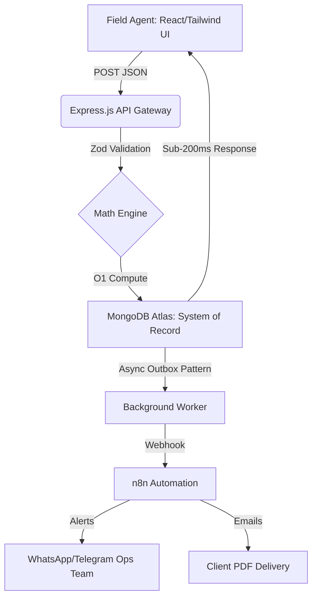

  

 

  
  
  
  
  
  

## 🚀 Executive Summary
The **Solyug Automated DPR Engine** is a high-performance, fault-tolerant MERN stack application designed specifically for solar EPC operations. It bridges the gap between field sales and engineering by instantly converting raw site data (Roof Area, Monthly Bill) into mathematically accurate Solar Preliminary Project Reports (DPRs), while simultaneously routing lead data to internal operations via n8n webhooks.

## 🏗️ System Architecture Flow

## 💡 Core Business Features
- ⚡ **Sub-200ms Intake:** Asynchronous background processing ensures the UI never freezes.
- 🧮 **Deterministic Solar Math:** MNRE/CERC compliant thumb-rules for Gujarat irradiation and tariffs.
- 🛡️ **Zero Lead Loss:** The "Outbox Pattern" ensures every lead is persisted to MongoDB before external dispatch.
- 📄 **Client-Side PDF Rendering:** Offloads CPU-heavy PDF generation to the browser, keeping backend costs at zero.

## 🛠️ Tech Stack Decisions
| Technology | Why we chose it for Solyug |
| :--- | :--- |
| **React + Vite** | Instant load times for field agents on 4G networks. |
| **Node/Express** | Non-blocking I/O perfect for handling webhook dispatches. |
| **MongoDB** | Flexible JSON schema allows easy addition of new solar metrics. |
| **Zod** | Strict runtime validation prevents garbage data from entering the CRM. |

---
*Built with ♥ by Shivam Bhadoriya & Team for Solyug Energy.*
